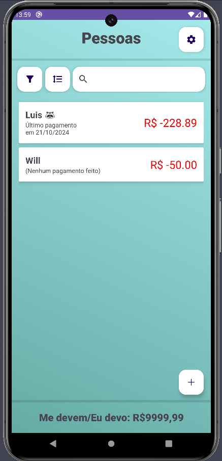
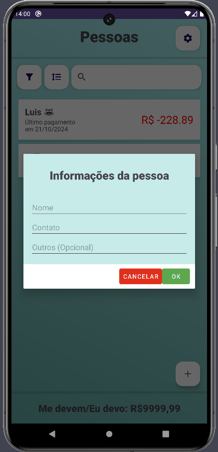
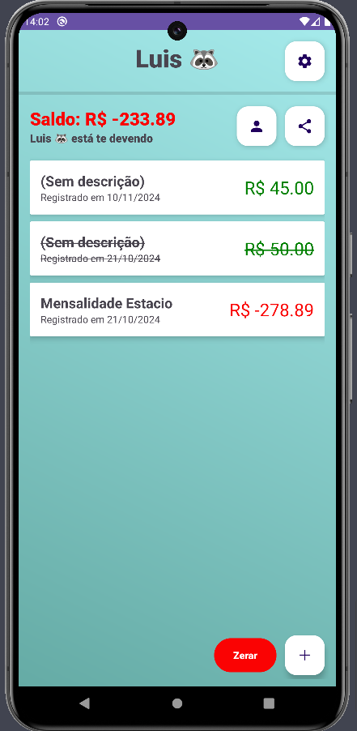
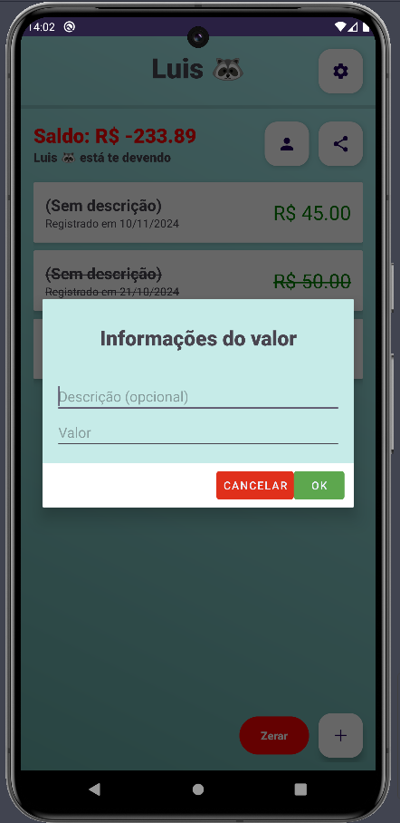

<h1 align="center" style="font-weight: bold;">
  Pagou? 💰
</h1>

  <a href="#description">Descrição</a> •
  <a href="#technologies">Tecnologias</a> •
  <a href="#starting">Começando</a> •
  <a href="#screens">Telas</a> •

  <b>Um aplicativo para gestão de fiados</b>

<h2 id="description">📜 Descrição</h2>

O objetivo do projeto é desenvolver um app de gestão de fiados para aposentar as antigas cadernetas
de devedores de pequenos comércios para evitar contas erradas, garantir a transparência de transações
alteradas para o cliente e envio de relatórios

<h2 id="technologies">💻 Tecnologias</h2>

- Kotlin
- Room ORM
- API do WhatsApp

<h2 id="starting">🏁 Começando</h2>

<h3>Pré-requisitos</h3>

- [Git](https://git-scm.com)
- [Android Studio](https://developer.android.com/studio)

<h3>Começando</h3>

1. Clone o projeto pelo seu Android Studio
2. Sincronize as dependências
3. Rode o app no seu celular ou emulador

<h2 id="screens">📱 Telas</h2>

<h3>LISTA DE PESSOAS</h3>

Aqui estão todas as pessoas cadastradas no aplicativo, incluindo seus saldos e últimos pagamentos
realizados.

- Para fazer um novo cadastro, aperte o botão inferior direito e preencha os campos corretamente
(não se preocupe, dá para alterar mais tarde)
- Para filtrar por _Me devem_, _Eu devo_, _Quitados_ ou sem filtro, aperte o botão de filtro e
selecione o que você desejar **[AINDA NÃO IMPLEMENTADO]**
- Para ordenar pelo nome ou pelo valor, aperte no botão de ordenação e selecione o que você
desejar **[AINDA NÃO IMPLEMENTADO]**
- Para pesquisar pelo nome, selecione a barra de pesquisa e insira o nome da pessoa
**[AINDA NÃO IMPLEMENTADO]**
- Caso queira fazer um backup ou já tenha um no seu Google Drive, aperte no botão de configuração
e faça a restauração ou um novo backup (é preciso fazer login pelo Google) **[AINDA NÃO IMPLEMENTADO]**
- Para ver as informações da pessoa, basta apertar em seu card

<h3>LISTA DE TRANSAÇÕES</h3>

Aqui estão todas as transações cadastradas da pessoa selecionada, incluindo seu saldo total, valor,
descricao e data de cada transação

- Para fazer um novo cadastro, aperte o botão inferior direito e preencha os campos corretamente
- Para editar ou deletar a pessoa, aperte no botão ao lado direito do saldo total
- Para enviar o relatório dessa pessoa, aperte no botão de compartilhar (requer conexão com a internet)
- Para editar uma transação ou inativá-la, basta apertar em seu card
- Resetar todas as transações dessa pessoa, aperte no botão vermelho

